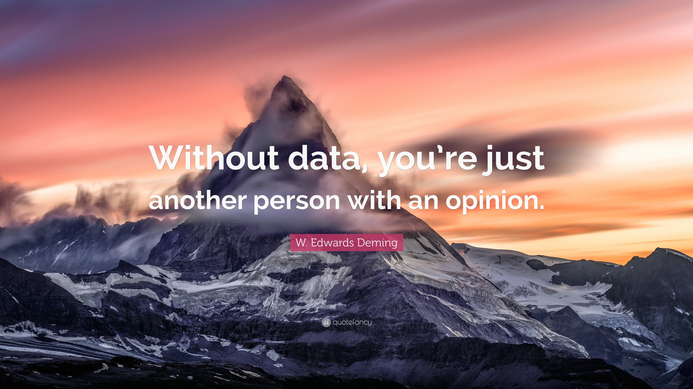

<!-- Header with your name and a short description -->
<h1>Hi 👋, I'm Leire Díez </h1>
<h3>Digital Business Analyst and Data Enthusiast.</h3>
<h4>👩🏽‍💻 With a burgeoning proficiency in Big Data and Artificial Intelligence, I combine a keen analytical aptitude with a creative mindset, leveraging technology to optimize business strategies through data. 🎯</h4>

<!-- Social icons section -->

  
  

<!-- Profile views -->

 
   

<!-- About me section -->
<h2>⭐ About Me</h2>

  
  🌱 I'm currently learning advanced data analytics techniques and big data tools. 
  👥 I'm looking to collaborate on innovative data analysis and business intelligence projects. 
  🚀 Ask me about digital marketing strategies and business analytics. 
  📪 How to reach me: leire.diez@student.ie.edu 

<!-- Education section -->
<h2>🎓 Education</h2>

  <ul>
    <li><strong>IE Science & Technology School</strong> Master in Business Analytics & Big Data</li>
    <li><strong>ESIC Business & Marketing School</strong> Bachelor of Digital Business</li>
    <li><strong>ESIC Business & Marketing School</strong> Bachelor of Global Marketing</li>
  </ul>

<!-- Languages section -->
<h2>🌍 Languages</h2>

  <ul>
    <li>Spanish (native)</li>
    <li>English (advanced)</li>
    <li>Basque (native)</li>
  </ul>

<!-- Technical Skills section -->
<h2>🛠️ Technical Skills</h2>

 
### Microsoft Office
.svg.png)
### GitHub

### Power BI

### SQL

### Azure

### Python

<!-- Top coding languages -->
<h2>📊 Coding languages</h2>

**Python**  
🟩🟩🟩🟩🟩🟩🟩🟩🟩⬜⬜ 75%

**SQL**  
🟦🟦🟦🟦🟦🟦🟦🟦🟦🟦⬜ 90%

<!-- Custom Section: Quotes or Fun Section -->
<h2>🌟 Quote of the Day</h2>

  

