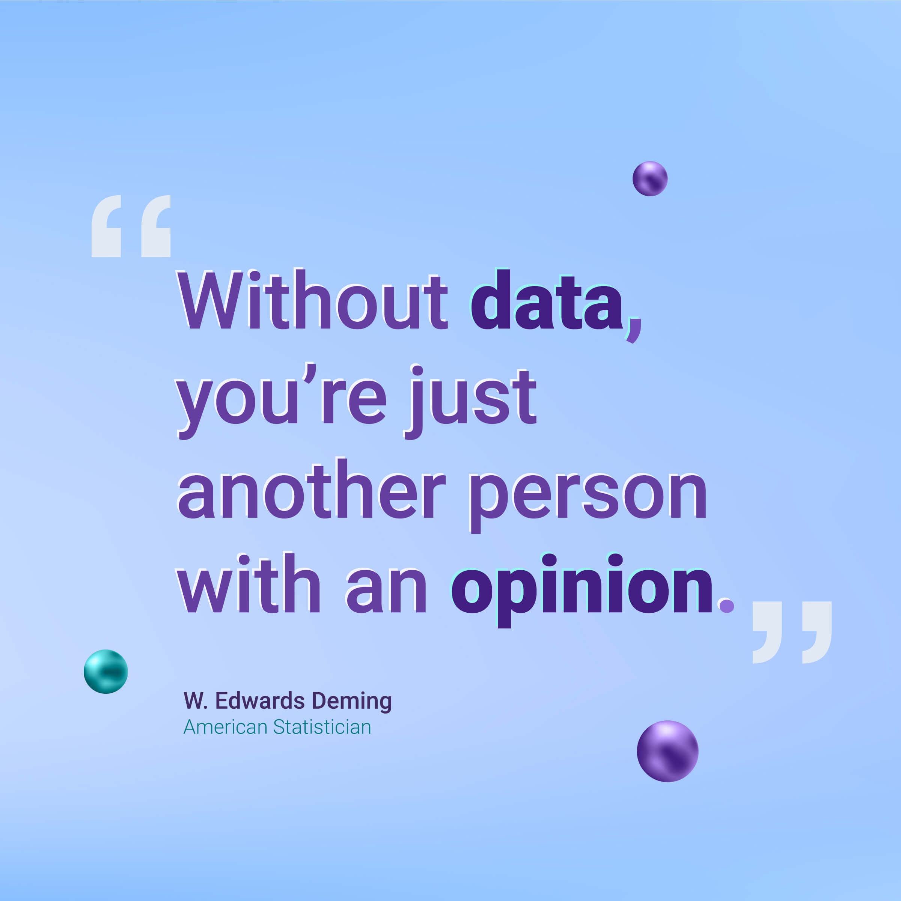

## Hi there 👋

<!-- Header with your name and a short description -->
<h1 align="center">Hi 👋, I'm Leire Díez </h1>
<h3 align="center">Digital Business Analyst and Data Enthusiast.</h3>
<h3 align="center">With a burgeoning proficiency in Big Data and Artificial Intelligence, 👩🏽‍💻 I combine a keen analytical aptitude with a creative mindset, leveraging technology to optimize business strategies through data. 🙏🏻</h3>

<!-- Social icons section -->

  
  

<!-- Profile views -->

 
   

<!-- About me section -->
<h2 align="center">About Me</h2>

  
  🌱 I'm currently learning advanced data analytics techniques and big data tools. 
  👯 I'm looking to collaborate on innovative data analysis and business intelligence projects. 
  💬 Ask me about digital marketing strategies and business analytics. 
  📫 How to reach me: leire.diez@student.ie.edu 

<!-- Education section -->
<h2 align="center">🎓 Education</h2>

  <ul>
    <li><strong>IE Science & Technology School</strong> Master in Business Analytics & Big Data</li>
    <li><strong>ESIC Business & Marketing School</strong> Bachelor of Digital Business</li>
    <li><strong>ESIC Business & Marketing School</strong> Bachelor of Global Marketing</li>
  </ul>

<!-- Languages section -->
<h2 align="center">🌐 Languages</h2>

  <ul>
    <li>Spanish (native)</li>
    <li>English (advanced)</li>
    <li>Basque (native)</li>
  </ul>

<!-- Technical Skills section -->
<h2 align="center">🛠️ Technical Skills</h2>

  
  
  
  
  
  
  
  

<!-- Top Languages -->
<h2 align="center">🗣️ Top Languages</h2>

  

<!-- Custom Section: Quotes or Fun Section -->
<h2 align="center">🌟 Quote of the Day</h2>

